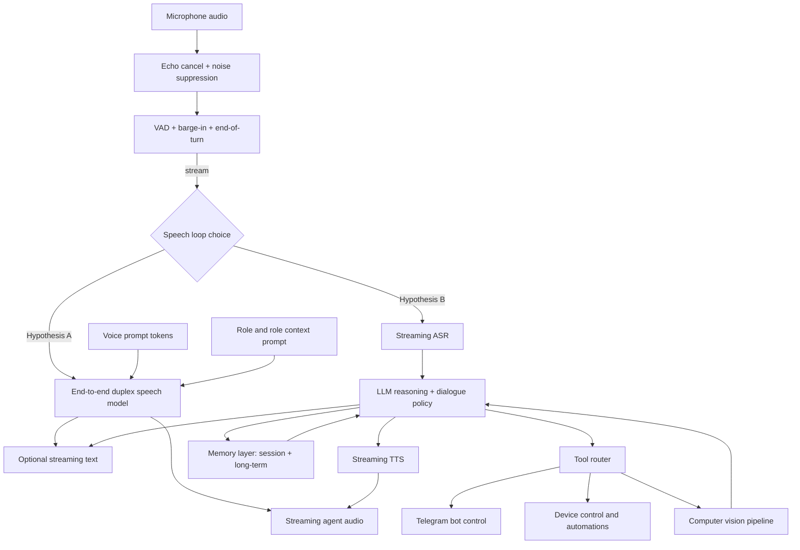
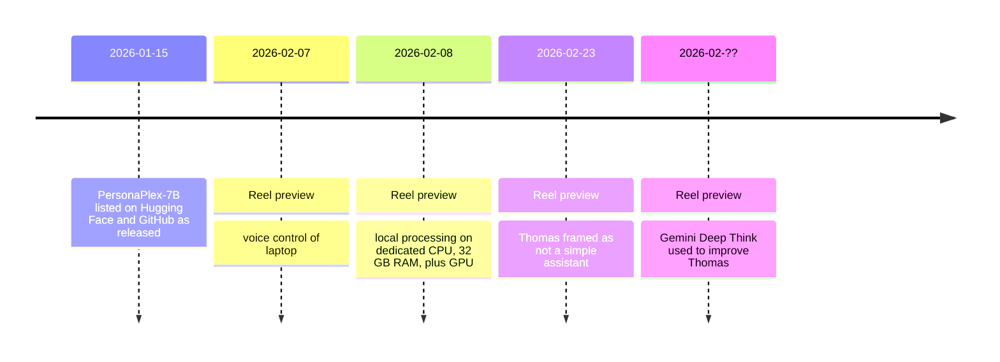

# Research report on abimaeel.silva’s T.H.O.M.A.S reel and the likely system behind it

## Executive summary

Public material from abimaeel.silva’s entity["company","Instagram","social platform"] presence presents “Thomas” (T.H.O.M.A.S.) as a personal AI assistant centered on low-latency voice interaction with a strong emphasis on local processing and direct device control. citeturn17search1turn8search8turn19search0

For Feb 23, 2026 (yesterday relative to Feb 24, 2026 in America/Chicago), the only clearly attributable public artifact tied to Thomas is a reel dated Feb 23, 2026 in search-indexed previews. The preview text frames Thomas as more than a basic assistant. No public code release, model weights release, or external demo endpoint appears alongside that reel. citeturn19search2turn11view0turn26view0

Nearby content supplies three concrete technical signals. First, he states the processing runs locally on a dedicated machine described as a dedicated CPU with 32 GB RAM plus a GPU. Second, he shows a voice-control layer that drives actions on a laptop. Third, he references computer-vision capability work as part of Thomas’s feature set. citeturn19search0turn8search8turn14search2

He also states he uses entity["company","Google DeepMind","ai research lab"]’s Gemini Deep Think to help improve Thomas, pointing to a workflow that blends local runtime goals with cloud reasoning support during development. citeturn34search0turn34search7turn34search11

The “full-duplex” feel implied by the reel context aligns closely with end-to-end speech-to-speech duplex models now available in open research and code. The most relevant primary reference is PersonaPlex-7B from entity["company","NVIDIA","gpu company"], which is explicitly documented as a real-time, full-duplex speech-to-speech model with role prompting and voice prompting, plus reproducible server code and gated weights on entity["company","Hugging Face","ml model hub"]. Evidence does not support a direct attribution of Thomas to PersonaPlex, since Thomas’s repo or logs are not public. The strongest evidence-based inference supports two plausible architectures: an end-to-end duplex speech model as the speech loop, or a modular pipeline (turn-taking plus ASR plus LLM plus TTS) with aggressive streaming orchestration. citeturn16view2turn16view0turn30view1turn36view0

## What was released yesterday

The only public release artifact that aligns to “yesterday” is a reel dated Feb 23, 2026, indexed as a reel by Abimael Silva, with preview text asserting Thomas is not a simple assistant like typical market assistants or basic projects. citeturn19search2

No public code artifact accompanies that date in the linked entity["company","GitHub","code hosting"] identity found via his profile links. The account’s visible repositories do not include a Thomas repository. citeturn11view0

The most relevant visible repository for his broader software patterns, cerebrourbano, shows its latest commit history dated Feb 27, 2025, which does not align with a Feb 2026 “release yesterday” claim for code. citeturn26view0

Given those constraints, “released yesterday” maps to the reel content itself: video, on-platform audio, and the accompanying caption or preview text. It does not map to publicly verifiable distribution of code, container images, or model weights. citeturn19search2turn11view0

## Inferred system architecture

Evidence anchors from abimaeel.silva content

A coherent feature set emerges across posts and previews:

He states local processing on dedicated hardware for Thomas, with 32 GB RAM and a GPU mentioned. citeturn19search0

He describes voice control of a laptop in a Feb 7, 2026 reel, implying an orchestration layer that translates spoken commands into OS actions or automation tasks. citeturn8search8

He references computer vision “feature extraction” work for Thomas in a separate reel preview, indicating at least one vision pipeline feeding into the agent’s decision logic. citeturn14search2

He states he uses Gemini Deep Think as a development assistant to improve Thomas, implying iterative debugging, design reasoning, or planning support from a cloud model during build time. citeturn34search0turn34search11

He also states he controls Thomas by Telegram in profile-indexed snippets, which strongly suggests a tool interface layer (bot endpoint, command routing, and a permission model). citeturn17search0

Two architecture hypotheses that fit the evidence

Hypothesis A, end-to-end duplex speech model in the core loop. This resembles PersonaPlex and Moshi-style designs. In this layout, the “speech loop” is a single model that listens and speaks concurrently, rather than a stitched ASR plus LLM plus TTS chain. PersonaPlex’s paper and model card describe exactly this: a duplex model based on Moshi with a “hybrid system prompt” that concatenates a voice prompt and a text prompt, after which the model autoregressively generates text and audio while receiving live user audio. citeturn30view1turn16view0turn30view0

Hypothesis B, modular real-time pipeline. This resembles the architecture documented by FireRedChat: a self-hosted full-duplex voice interaction system integrating TTS, ASR, a personalized VAD module, and end-of-turn detection, plus a separate LLM server (examples include Ollama or vLLM). FireRedChat also documents a real-time communication layer and an orchestration stack. citeturn36view0

Given abimaeel.silva’s earlier public code patterns, the modular pipeline remains plausible. In cerebrourbano’s chatbot module, he used external API calls for chat completions, with a system prompt and fallback responses, which maps directly to a “planner plus tools plus UI” pattern. citeturn24view0

Mermaid flowchart of the inferred Thomas system

The flowchart below encodes a single inferred system with a branch at the speech loop. The branch reflects the evidence gap.



The PersonaPlex path is grounded in primary docs describing duplex audio IO and hybrid prompting. citeturn30view1turn16view2 The modular path is grounded in FireRedChat’s documented stack and in the abimaeel1 code pattern of “prompted model plus fallback plus services.” citeturn36view0turn24view0 Telegram control and computer-vision hints come from Instagram-indexed snippets and reel previews tied to Thomas. citeturn17search0turn14search2

Mermaid timeline of artifacts and releases

This timeline includes Thomas-related posts that form the best available public trail, plus the ecosystem model release most relevant to full-duplex voice.



PersonaPlex’s release date is stated in its model card. citeturn16view0turn16view2 The Feb 7, Feb 8, and Feb 23 reels are indexed with dates and preview text. citeturn8search8turn19search0turn19search2 The Gemini Deep Think statement is directly indexed in a reel preview and aligns to official product announcements. citeturn34search0turn34search11

## Hardware and latency implications

What low-latency duplex voice implies

Moshi’s public documentation explains why duplex speech models feel fast. Moshi models two audio streams (user and agent) and predicts text tokens as an “inner monologue,” using a temporal transformer plus a depth transformer, with a streaming neural codec (Mimi). It reports a theoretical latency of 160 ms and practical overall latency as low as 200 ms on an L4 GPU. citeturn28view0

PersonaPlex builds on Moshi. Its paper describes the duplex architecture and hybrid system prompt. It also reports benchmark latencies for the released checkpoint on FullDuplexBench categories, with latency values reported at 0.170 and 0.240 in the released-checkpoint table. citeturn30view1turn30view2

This places an evidence-based lower bound on what “crazy fast” voice interactivity could look like under a Moshi-style end-to-end stack: sub-second response behavior driven by streaming audio tokens and concurrent listen-speak. citeturn28view0turn30view2

What abimaeel.silva’s claimed hardware implies

In a Feb 8, 2026 reel preview, abimaeel.silva states processing runs locally, on a dedicated CPU for Thomas with 32 GB RAM and a GPU. That points to either a smaller local model or an optimized streaming setup on consumer GPU hardware. citeturn19search0

Moshi’s repo notes a key constraint for end-to-end duplex models in PyTorch: it states no quantization support for the PyTorch version at that time and recommends a GPU with significant memory, explicitly mentioning 24 GB. This matters because PersonaPlex’s reference implementation is also PyTorch-based. citeturn28view0turn16view2

The PersonaPlex repo includes a CPU offload option, implying operation on GPUs with less memory, trading speed for feasibility. citeturn16view2

Operational software stack implications

PersonaPlex’s repo documents a server and web UI approach. It lists Opus as a prerequisite dependency and shows a live server command that runs the model behind an HTTPS UI on port 8998, with optional CPU offload. citeturn16view2turn27view1

Its Python project metadata lists dependencies like torch, sentencepiece, sounddevice, and sphn, which suggests a custom audio pipeline around PyTorch rather than a generic text-only inference stack such as vLLM. citeturn27view0

By contrast, FireRedChat explicitly endorses modular LLM backends such as Ollama or vLLM for the LLM portion, alongside separate ASR and TTS services and a real-time communication server. This approach fits teams prioritizing self-hosting, swapping components, and controlling latency module-by-module. citeturn36view0

Other open systems reinforce expected hardware targets. FLM-Audio’s repo recommends an NVIDIA GPU with at least 20 GB VRAM for stable inference and documents a streaming voice demo server pattern. citeturn37view0 Qwen2.5-Omni’s repo documents real-time streaming responses, explicit vLLM support, and availability of 4-bit quantized variants to reduce VRAM needs. citeturn38view1

## Privacy, security, and ethics

Local-first versus cloud usage in abimaeel.silva’s footprint

The clearest privacy positioning in Thomas content is the claim of fully local processing “as always,” paired with dedicated local hardware. Local processing reduces exposure of raw voice data to third-party API providers, assuming logs and telemetry stay local. citeturn19search0

A contrasting signal appears in the abimael1 cerebrourbano repository. The chatbot implementation sends user input to a hosted endpoint at deepinfra.com using a model labeled deepseek-chat, keyed via an environment variable. citeturn24view0 The AI analyzer module initializes an Anthropic client and calls a Claude model (claude-3-sonnet-20240229) for structured analysis outputs. citeturn24view1

Those two artifacts show a hybrid pattern in his past public code: local app plus cloud AI backends. That does not contradict the Thomas local-first claim, but it shows a precedent for cloud inference in adjacent work. citeturn24view0turn24view1turn19search0

Voice cloning and identity risks in duplex speech models

PersonaPlex explicitly supports voice prompting for voice control. The paper describes “audio-based voice cloning” via a voice prompt segment in the hybrid system prompt, enabling “zero-shot voice cloning.” citeturn30view1turn30view0 That capability increases impersonation risk if users feed a target speaker sample without consent.

The PersonaPlex model card also frames the model as “ready for commercial use” and places its weights under a gated access and license agreement, which suggests the publisher recognizes downstream risk and compliance concerns in distribution. citeturn16view0

Operational failure modes to expect in real-time voice agents

Echo and barge-in issues are common risk points for duplex voice systems. Moshi’s repo notes that its command-line clients do not do echo cancellation and do not compensate for growing lag by skipping frames, while recommending the web UI for better echo cancellation. citeturn28view0

In modular stacks, the key failure modes cluster around turn-taking and interruption handling. FireRedChat’s design foregrounds pVAD (personalized voice activity detection) and turn detection to improve barge-in. That emphasis itself signals that interruption control remains a frequent failure mode without dedicated components. citeturn36view0

## Reproducibility and validation experiments

Reproducibility baseline

There is no public, fully reproducible build of Thomas visible in the artifact trail examined here. The most practical way to reproduce a Thomas-like experience is to start from a published, reproducible duplex system and add tool integrations.

Option A, PersonaPlex baseline. The PersonaPlex repo provides a complete server launch path and offline evaluation examples. It requires Opus, a Hugging Face token after accepting the model license, and a server command that exposes a web UI. citeturn16view2turn27view1

Option B, modular stack baseline. FireRedChat provides a self-hosted full-duplex scaffolding with LiveKit, Redis, ASR, TTS, pVAD, and turn detection, leaving the LLM backend choice open. citeturn36view0

Minimal hardware and OS expectations

For a Moshi-family end-to-end duplex model in PyTorch, Moshi’s documentation states the PyTorch version lacks quantization support at that time and points to a 24 GB GPU need. That suggests high VRAM demands for similar PyTorch duplex setups. citeturn28view0

For systems that offer quantization or alternative runtimes, the hardware floor drops. Moshi has an MLX implementation distributed on PyPI and tested on Apple silicon, with explicit q4 and q8 usage modes. citeturn39view0

For a modular system, FireRedChat shifts compute load across separate services, which gives more freedom to budget GPU memory across ASR, LLM, and TTS rather than forcing a single large end-to-end model footprint. citeturn36view0

Validation experiments to test “fast duplex voice” claims

Latency. Measure end-to-end microphone-to-speaker delay under controlled conditions. Use a click or short phoneme as an impulse and measure time to first audible output. For duplex systems, add an interruption test: speak during output and measure time to model adaptation. PersonaPlex publishes latency metrics on FullDuplexBench and defines a benchmark environment for turn-taking and interruptions. citeturn30view2turn30view0

Conversational dynamics. Use takeover rate and backchannel metrics where available. PersonaPlex reports full-duplex bench metrics and extends evaluation to customer service roles. citeturn30view0turn30view2

ASR impact under modular stacks. For pipeline systems, compute WER on a fixed audio test set, then measure how WER changes with background speech overlap and with echo from the agent output. FireRedChat’s focus on pVAD and turn detection indicates these conditions drive real-world performance gaps. citeturn36view0

Speech naturalness. Use MOS style evaluation with multiple raters and consistent prompt scripts. PersonaPlex reports dialog naturalness MOS and voice similarity measures in its paper, which offers a template for evaluation design. citeturn30view2turn30view0

## Comparison with similar open-source voice and duplex systems

The table below summarizes a set of open systems referenced in primary repos and papers. “Real-time duplex” means concurrent listen-speak behavior is explicitly a goal in the repo or paper. “Streaming” means incremental output delivery is explicit, even if true duplex overlap is not the headline.

| System | Params | License for code | Weights license | Real-time duplex focus | Primary repo or model source |
| --- | --- | --- | --- | --- | --- |
| PersonaPlex-7B | 7B citeturn16view0 | MIT citeturn16view2 | NVIDIA Open Model License, gated citeturn16view0 | Yes, full duplex listen-speak citeturn16view0turn30view1 | Repo and usage docs citeturn16view2 |
| Moshi | 7B class citeturn28view0 | MIT for Python, Apache for Rust citeturn28view0 | CC-BY 4.0 citeturn28view0 | Yes, full duplex framework citeturn28view0 | Repo and architecture docs citeturn28view0 |
| FireRedChat | Not a single model | Apache-2.0 citeturn36view0 | Released components plus external LLM choice citeturn36view0 | Yes, system-level full-duplex voice interaction citeturn36view0 | Repo and system architecture citeturn36view0 |
| FLM-Audio | 7B class in related paper trail citeturn15search10 | Apache-2.0 citeturn37view0 | Repo references hosted checkpoints citeturn37view0 | Yes, native full duplex plus streaming IO citeturn37view0 | Repo and demo docs citeturn37view0 |
| Freeze-Omni | Frozen LLM plus speech modules citeturn38view0 | Custom, research-only, non-commercial terms citeturn41view0 | Included in same restricted license text citeturn41view0 | Duplex via state prediction and interruption logic citeturn38view0 | Repo and release notes citeturn38view0turn41view0 |
| Qwen2.5-Omni-7B | 7B citeturn38view1turn35search1 | Apache-2.0 citeturn38view1 | Model cards per release notes citeturn38view1turn35search9 | Streaming real-time voice output stated, duplex overlap not the central claim in the excerpt citeturn38view1 | Repo and deployment notes citeturn38view1 |

This comparison also clarifies a key inference for Thomas. A Thomas-like experience does not require a single end-to-end duplex model. A modular system with strong barge-in detection, fast ASR, fast TTS, and streaming orchestration achieves a similar user-perceived latency profile, which matches FireRedChat’s documented design goals. citeturn36view0

## Sources and reproducibility appendix

Sources list

1. abimaeel.silva Instagram bio snippet with roles, affiliations, and location. citeturn17search1  
2. Reel preview dated Feb 23, 2026 asserting Thomas is not a simple assistant. citeturn19search2  
3. Reel preview dated Feb 8, 2026 stating local processing, dedicated CPU, 32 GB RAM, plus GPU. citeturn19search0  
4. Reel preview dated Feb 7, 2026 describing voice control of a notebook. citeturn8search8  
5. Reel preview stating Gemini Deep Think is used to improve Thomas. citeturn34search0  
6. Mentes Inovadoras School LinkedIn company snippet. citeturn20search3  
7. COEXUM AI Instagram profile snippet. citeturn20search25  
8. GitHub profile for abimael1 linking to Instagram, listing role focus and location. citeturn11view0  
9. GitHub commit history showing cerebrourbano last commits in Feb 2025. citeturn26view0  
10. cerebrourbano chatbot module using DeepInfra hosted chat completions and deepseek-chat. citeturn24view0  
11. cerebrourbano AI analyzer module using Anthropic client and a Claude model. citeturn24view1  
12. PersonaPlex Hugging Face model card with license gating, description, architecture references, and release date. citeturn16view0  
13. PersonaPlex GitHub repo with installation and server commands plus CPU offload option. citeturn16view2  
14. PersonaPlex preprint PDF, figure showing hybrid system prompt and duplex generation. citeturn30view1turn30view0  
15. PersonaPlex preprint PDF, released-checkpoint section with 1,217 hours Fisher data and latency table. citeturn30view2  
16. Moshi GitHub repo describing duplex architecture, Mimi codec, and reported latencies and memory guidance. citeturn28view0  
17. moshi-mlx PyPI package page documenting MLX runtime and q4 or q8 usage. citeturn39view0  
18. FireRedChat GitHub repo describing system architecture, privacy posture, and included modules. citeturn36view0  
19. FLM-Audio GitHub repo with duplex description, demo, and hardware guidance. citeturn37view0  
20. Freeze-Omni GitHub repo with release notes and inference server guidance. citeturn38view0  
21. Freeze-Omni license file stating research-only, non-commercial restriction and bundled terms. citeturn41view0  
22. Qwen2.5-Omni GitHub repo with streaming speech generation and deployment notes including vLLM and quantized variants. citeturn38view1  
23. Official Gemini 3 Deep Think announcement and access model. citeturn34search11  
24. Google DeepMind blog post on Gemini Deep Think research workflow framing. citeturn34search7  

Reproducibility commands

PersonaPlex baseline (server)

```bash
git clone https://github.com/NVIDIA/personaplex
cd personaplex

# Ubuntu
sudo apt update
sudo apt install -y libopus-dev

# install the python package inside the repo
pip install moshi/.

# accept the model license on Hugging Face in a browser, then set token
export HF_TOKEN="hf_your_token_here"

SSL_DIR=$(mktemp -d)
python -m moshi.server --ssl "$SSL_DIR"
```

PersonaPlex baseline (offline wav-to-wav)

```bash
export HF_TOKEN="hf_your_token_here"
python -m moshi.offline \
  --voice-prompt "NATF2.pt" \
  --input-wav "assets/test/input_assistant.wav" \
  --seed 42424242 \
  --output-wav "output.wav" \
  --output-text "output.json"
```

FireRedChat baseline (high-level scaffold)

```bash
git clone --recurse-submodules https://github.com/FireRedTeam/FireRedChat.git
cd FireRedChat/docker
docker-compose up -d
```

Moshi MLX local test (Apple silicon)

```bash
pip install moshi-mlx
python -m moshi_mlx.local -q 4
```